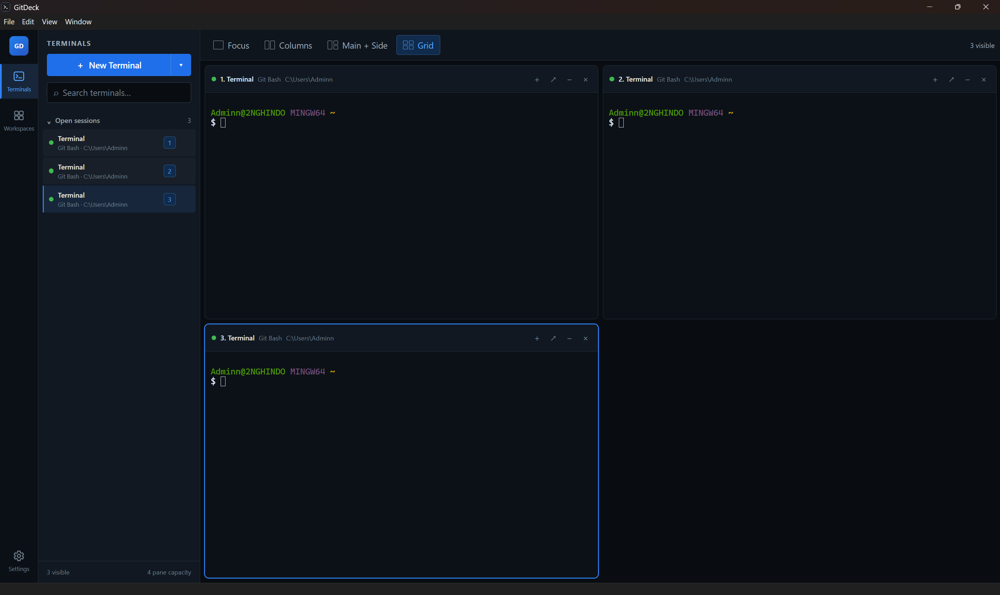

# GitDeck

> A local-first Windows terminal workspace manager for developers who work with
> several shells at once.



GitDeck replaces a crowded terminal tab bar with a searchable session Navigator
and a live Mosaic canvas. Keep up to four terminals visible, park the rest without
stopping them, and restore project terminal definitions through Workspaces.

## What it does

- Runs Git Bash, PowerShell, Command Prompt, or WSL when they are installed.
- Provides Focus, Columns, Main + Side, and Grid terminal layouts.
- Keeps parked terminals running and preserves their output and scrollback.
- Saves workspace definitions: terminal name, shell, directory, and startup command.
- Shows read-only Git branch and working-tree status for the focused terminal.
- Inspects local listening ports and terminates an owning process only after confirmation.

## Install on Windows

GitDeck currently targets **Windows 10/11 x64**.

1. Open [GitHub Releases](https://github.com/b0yblake/Git-SCM-management/releases).
2. Download `GitDeck Setup <version>.exe` from the latest release.
3. Run the installer, choose an install directory, then launch GitDeck from the
   Start menu or desktop shortcut.

> GitDeck is currently unsigned. Windows SmartScreen may show a warning; verify
> that the installer came from this repository before choosing **More info → Run
> anyway**. If Releases contains no installer, a public binary has not been
> published yet—use the source workflow below.

GitDeck detects available shells automatically. Git Bash requires
[Git for Windows](https://git-scm.com/download/win); PowerShell and Command Prompt
are normally already available on Windows.

## Run from source

Requirements: Git and **Node.js 22.22.2 or newer**.

```powershell
git clone https://github.com/b0yblake/Git-SCM-management.git
cd Git-SCM-management
npm ci
npm run dev
```

To build a local Windows installer:

```powershell
npm run package
```

The installer is written to `release/GitDeck Setup <version>.exe`. Before opening
a pull request, run `npm run ci` and `npm run build`.

## How it works

1. **New Terminal** creates a real operating-system shell owned by the Electron
   Main process.
2. The Navigator lists every session; the selected layout assigns running
   sessions to visible panes.
3. Parking a pane removes it from the Mosaic only. Closing it ends the shell.
4. A Workspace persists terminal definitions—not live processes—and recreates
   fresh shells when opened or restored.
5. Closing GitDeck stops the terminal processes it owns.

| Shortcut | Action |
|---|---|
| `Ctrl+T` | Create a terminal |
| `Ctrl+W` | Close the focused terminal |
| `Ctrl+Tab` | Focus the next session |
| `Ctrl+Shift+Tab` | Focus the previous session |

## Public policy

- **Privacy:** GitDeck has no account, cloud sync, analytics, or telemetry.
  Settings, workspaces, and rotating operational logs stay under the local
  Electron application-data directories. Terminal input and output are not logged.
- **Command safety:** Git integration is read-only and cannot commit, push, pull,
  merge, or reset. Workspace startup commands run when a workspace is opened;
  automatic rerun during startup restore is disabled unless the user opts in.
- **Process safety:** Port termination is local, explicit, and process-scoped.
  GitDeck shows every affected binding, requires confirmation, revalidates the
  target, and protects its own and system processes.
- **Security reports:** Do not post credentials, private paths, or logs in public
  issues. Report vulnerabilities through
  [GitHub private security advisories](https://github.com/b0yblake/Git-SCM-management/security/advisories/new).
- **Support:** Issues and pull requests are reviewed on a best-effort basis; no
  support SLA or production warranty is provided.
- **License:** The repository is currently `UNLICENSED`. Public source visibility
  does not grant permission to redistribute or sublicense the project. Add an
  explicit license before presenting GitDeck as open source.

Architecture, test contracts, and implementation phases are documented in
[`plans/`](plans/).
