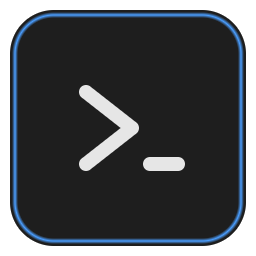

<div align="center">



# GitDeck

**See every shell. Lose none.**

A local-first terminal workspace manager for Windows developers who run
several shells at once — dev server, build watcher, git, logs — and are tired
of hunting for them in a crowded tab bar.

[](https://github.com/b0yblake/Git-SCM-management/releases)


</div>

## Why GitDeck?

Tab bars hide your terminals. GitDeck deals them onto a table instead:

1. **Mosaic** — a live canvas that keeps up to four terminals visible at once.
2. **Navigator** — a searchable list of every session, visible or parked.
3. **Workspaces** — saved terminal setups you can reopen with one click.

Every terminal is a real operating-system shell — Git Bash, PowerShell,
Command Prompt, or WSL — not an emulation.

---

## 🖥️ Terminal Mosaic

Choose how many shells share the canvas. Switch layouts any time; sessions
keep running no matter where they sit.

| Layout               | Visible panes | Shape                                    |
| -------------------- | :-----------: | ---------------------------------------- |
| **Focus**            |       1       | One terminal fills the canvas            |
| **Columns**          |       2       | Two equal vertical panes                 |
| **Main + Side**      |       3       | Large pane left, two stacked panes right |
| **Grid** _(default)_ |       4       | Responsive 2×2 mosaic                    |

**Park, don't kill.** Remove a terminal from the canvas without stopping it.
A parked shell keeps running in the background with its output and scrollback
preserved — bring it back exactly where it left off. Closing a terminal is the
only action that ends its shell.

## 🧭 Session Navigator

The Navigator lists every session — on the canvas or parked — with its shell,
working directory, and a live status dot. Type to search when the list grows;
click to focus. `Ctrl+Tab` cycles through sessions without touching the mouse.

## 🐚 Real shells, auto-detected

GitDeck detects what's installed and offers it in the **New Terminal** menu:

- **Git Bash** (requires [Git for Windows](https://git-scm.com/download/win))
- **PowerShell**
- **Command Prompt**
- **WSL**

Each session is a real shell process owned by GitDeck. Close GitDeck and it
cleanly stops the processes it owns — nothing lingers.

## 💾 Workspaces

A workspace is a **blueprint, not a snapshot**. It saves what each terminal
_is_, then recreates it fresh on demand:

```text
📄 Workspace "web-app"
├─ 1. API server   Git Bash    C:\work\api    npm run dev
├─ 2. Frontend     Git Bash    C:\work\web    npm run dev
└─ 3. Scratch      PowerShell  C:\work
```

For each terminal a workspace stores four things: **name**, **shell**,
**directory**, and an optional **startup command**.

- **Open a workspace** → fresh shells spawn in the right folders and startup
  commands run.
- **Relaunch GitDeck** → with restore enabled, your last workspace comes back,
  including which tab was active. Startup commands do **not** rerun on restore
  unless you explicitly opt in — a restart never surprises you with a rebuild.
- Live processes are never persisted; restore recreates definitions only.

## 🔎 Also on deck

|                           |                                                                                                                                                                                                                                              |
| ------------------------- | -------------------------------------------------------------------------------------------------------------------------------------------------------------------------------------------------------------------------------------------- |
| **Git status, read-only** | The focused terminal shows its repo's branch and working-tree status. GitDeck can _see_ your repo but can never commit, push, pull, merge, or reset it.                                                                                       |
| **Port inspector**        | See which local ports are listening and which process owns them. Terminating a process is explicit: GitDeck shows every affected binding, asks for confirmation, revalidates the target, and protects system processes and itself.            |

## ⌨️ Shortcuts

| Shortcut          | Action                     |
| ----------------- | -------------------------- |
| `Ctrl+T`          | New terminal               |
| `Ctrl+W`          | Close the focused terminal |
| `Ctrl+Tab`        | Next session               |
| `Ctrl+Shift+Tab`  | Previous session           |

---

## 🚀 Install

GitDeck targets **Windows 10/11 x64**.

1. Download `GitDeck Setup <version>.exe` from
   [GitHub Releases](https://github.com/b0yblake/Git-SCM-management/releases).
2. Run the installer, then launch GitDeck from the Start menu or desktop
   shortcut.

> **Unsigned build:** Windows SmartScreen may warn. Verify the installer came
> from this repository, then choose **More info → Run anyway**. If Releases
> contains no installer yet, use the source workflow below.

### Run from source

Requires Git and **Node.js 22.22.2 or newer**.

```powershell
git clone https://github.com/b0yblake/Git-SCM-management.git
cd Git-SCM-management
npm ci
npm run dev
```

Build a local installer with `npm run package` — it is written to
`release/GitDeck Setup <version>.exe`. Before opening a pull request, run
`npm run ci` and `npm run build`.

## 🔒 Privacy & safety

- **Local-first.** No account, cloud sync, analytics, or telemetry. Settings,
  workspaces, and rotating operational logs stay under the local Electron
  application-data directories. Terminal input and output are not logged.
- **Uninstall keeps your data.** Removing GitDeck leaves settings and
  workspaces in `%APPDATA%\GitDeck` so a reinstall finds them; delete that
  folder yourself to remove every trace. The data folder itself is
  relocatable from Settings — switching copies your data to the chosen
  folder on the next start and never deletes the old one.
- **Update check, disclosed.** At startup — at most once a day — GitDeck makes
  one anonymous HTTPS request to the GitHub Releases API to learn whether a
  newer version exists. Nothing is downloaded or installed; no account, token,
  or identifier is sent. A dismissible notice links to the release page, and
  the check can be turned off in Settings.
- **Read-only Git.** The Git integration cannot modify a repository.
- **Explicit process control.** Port termination is local, confirmed, and
  process-scoped.
- **Security reports:** use
  [GitHub private security advisories](https://github.com/b0yblake/Git-SCM-management/security/advisories/new) —
  never post credentials, private paths, or logs in public issues.
- **License:** currently `UNLICENSED`. Public source visibility does not grant
  permission to redistribute or sublicense the project.
- **Support:** issues and pull requests are reviewed on a best-effort basis; no
  support SLA or production warranty is provided.

---

<div align="center">

Architecture, test contracts, and implementation phases are documented in
[`plans/`](plans/).

</div>
